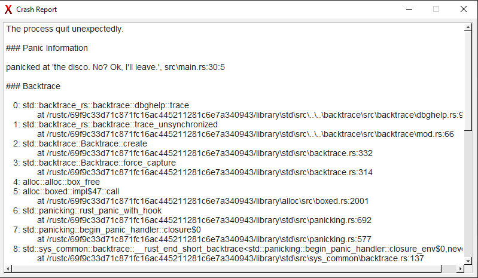

<div align="center">
    <h1>panicui</h1>
    
</div>

---

## Description

[panicui](https://crates.io/crates/panicui) provides a simple solution to easier debugging by utilizing user interface.

panicui allows you to create panic hooks that open a crash log window in just 7 lines of code.



## Why use panicui?

### 1. Extremely lightweight

Binary size of the program shown above (no strip, with debug symbols): ~1,010KB (0.98MB)

### 2. Fast build times

panicui only uses one direct dependency, [fltk-rs](https://crates.io/crates/fltk).

### 3. Portable across every platform

panicui uses [fltk](https://www.fltk.org/) for UI, which works across practically every platform. This includes:

- UNIX
- Linux (X11)
- Windows
- MacOS X

---

## Example usage

<sub>More examples are available in the <a href="https://github.com/imajindevon/panicui/tree/main/examples/">examples</a> folder.</sub>

```rust
use panicui::app::PanicApplication;
use panicui::style::Style;
use panicui::window::PanicWindow;
use std::backtrace::Backtrace;
use std::panic;
use std::panic::PanicInfo;

fn panic_hook(info: &PanicInfo) {
    let backtrace = Backtrace::force_capture();
    let crash_text = format!("{info}\n{backtrace}");

    let win = PanicWindow::new(Style::default(), crash_text);

    let mut app = PanicApplication::new(win);
    app.run().expect("Unable to run application.");
}

fn main() {
    panic::set_hook(Box::new(panic_hook));

    // Cause some random panic.
    Result::<(), _>::Err(5i32).unwrap();
}
```